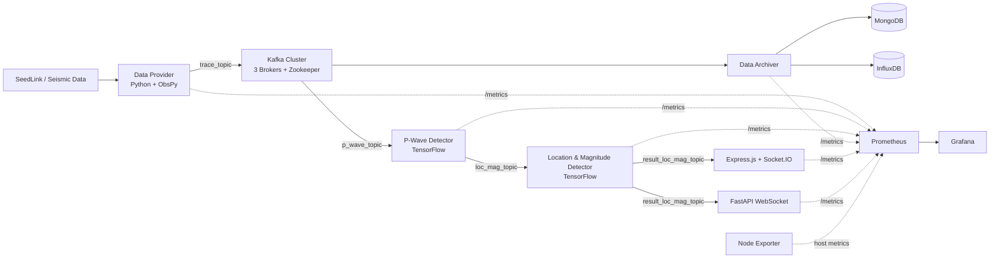

# MDLBEEWS: Modular Deep Learning Based Earthquake Early Warning System

MDLBEEWS adalah sistem peringatan dini gempa berbasis microservices dan event-driven pipeline. Sistem menerima data seismik melalui SeedLink, mengirimkannya melalui Kafka, mendeteksi gelombang-P dengan model deep learning, memperkirakan lokasi dan magnitudo, mengarsipkan data, serta menyebarkan hasil secara real-time melalui WebSocket.

Repository ini juga menyediakan observability stack Prometheus dan Grafana untuk mengukur CPU, memory, throughput, jumlah request, latency, dan end-to-end delay.

## 1. Arsitektur Sistem



### Komponen

| Komponen | Fungsi |
|---|---|
| Data Provider | Mengambil data SeedLink/MiniSEED dan mempublikasikan trace ke `trace_topic`. |
| P-Wave Detector | Mengonsumsi trace, menjalankan model TensorFlow, dan menghasilkan event ke `loc_mag_topic`. |
| Location & Magnitude Detector | Mengestimasi lokasi dan magnitudo berdasarkan hasil deteksi gelombang-P. |
| Data Archiver | Mengarsipkan trace dan metadata ke MongoDB/InfluxDB. |
| Express API Server | Menyediakan Data Table dan WebSocket berbasis Express.js/Socket.IO pada port 3333. |
| FastAPI Server | Menyediakan WebSocket alternatif pada port host 3334. |
| Kafka + Zookeeper | Message broker untuk komunikasi asynchronous antarlayanan. |
| Prometheus | Mengambil metric dari service melalui endpoint `/metrics`. |
| Grafana | Menampilkan dashboard observability. |
| Node Exporter | Menyediakan metric CPU, memory, disk, dan host lainnya. |
| Mongo Express | Antarmuka pemeriksaan MongoDB. |

### Topik Kafka

| Topik | Aliran |
|---|---|
| `trace_topic` | Data Provider -> P-Wave Detector/Data Archiver |
| `p_wave_topic` | Input jalur deteksi P-Wave |
| `loc_mag_topic` | P-Wave Detector -> Loc-Mag Detector |
| `result_loc_mag_topic` | Loc-Mag Detector -> WebSocket Server |

## 2. Prasyarat dan Link Download

### Windows

- [Docker Desktop](https://www.docker.com/products/docker-desktop/)
- [Git for Windows](https://git-scm.com/download/win)
- [Python 3.10+](https://www.python.org/downloads/)
- PowerShell, tersedia secara bawaan di Windows

### Ubuntu VM

- [Docker Engine Ubuntu](https://docs.docker.com/engine/install/ubuntu/)
- [Docker Compose plugin](https://docs.docker.com/compose/install/linux/)
- [Git](https://git-scm.com/download/linux)
- Python 3.10+ untuk script pengumpulan metric

Spesifikasi yang disarankan: 4 vCPU atau lebih, RAM minimal 8 GB (disarankan 16 GB), ruang kosong minimal 30 GB, sistem operasi 64-bit, dan akses internet.

## 3. Pemeriksaan Prasyarat

```bash
docker --version
docker compose version
git --version
python --version
```

Install library untuk pengumpulan metric:

```bash
python -m pip install requests
```

Ubuntu dapat menggunakan `python3` dan `python3 -m pip`.

## 4. Clone dan Konfigurasi

Clone pertama kali:

```bash
git clone https://github.com/mohamadsolkhannawawi/MDLBEEWS-V3.git
cd MDLBEEWS-V3
```

Update source code:

```bash
git pull origin main
```

Windows PowerShell:

```powershell
Copy-Item .env.example .env
Copy-Item influxDB\.env.example influxDB\.env
```

Ubuntu:

```bash
cp .env.example .env
cp influxDB/.env.example influxDB/.env
```

Validasi konfigurasi:

```bash
docker compose config
```

Jika Ubuntu menampilkan `Permission denied` pada `influxDB/.env`:

```bash
sudo chown -R $USER:$USER ~/MDLBEEWS-V3/influxDB
chmod 755 ~/MDLBEEWS-V3/influxDB
chmod 600 ~/MDLBEEWS-V3/influxDB/.env
```

Jangan commit `.env` atau token InfluxDB.

## 5. Menjalankan Aplikasi

Build dan start seluruh sistem:

```bash
docker compose up -d --build
```

Start tanpa build ulang:

```bash
docker compose up -d
```

Periksa status:

```bash
docker compose ps
```

Service utama harus berstatus `Up (healthy)`: `api_server`, `fast_api`, `data_provider`, `p_wave_detector`, `loc_mag_detector`, dan `data_archiver`. Kafka, Zookeeper, MongoDB, InfluxDB, Prometheus, dan Grafana minimal harus `Up`.

Urutan wajib sebelum mengambil angka pengujian:

1. Pastikan Docker Engine berjalan.
2. Pastikan `.env` dan `influxDB/.env` tersedia.
3. Jalankan `docker compose config`.
4. Jalankan `docker compose up -d` atau `docker compose up -d --build`.
5. Tunggu 30 sampai 60 detik agar Kafka selesai startup.
6. Jalankan `docker compose ps` dan tunggu service utama `Up (healthy)`.
7. Periksa kesiapan Prometheus dengan `curl.exe http://localhost:9090/-/ready` pada Windows atau `curl http://localhost:9090/-/ready` pada Ubuntu.
8. Jalankan query Prometheus `up` dan pastikan target utama bernilai `1`.
9. Periksa log service utama.
10. Untuk S1a jalankan `tests/collect_host_metrics.ps1`; untuk S1b-S4 jalankan `tests/collect_metrics.py`.

Jangan menjalankan pengumpulan metric setelah script skenario selesai tanpa menjalankan Compose lagi, karena script skenario membersihkan container pada akhir eksekusi.

## 6. URL Aplikasi dan Credential

| Layanan | URL | Input |
|---|---|---|
| Express Data Table | `http://localhost:3333` | Tidak ada |
| Express metrics | `http://localhost:8107/metrics` | Tidak ada |
| FastAPI WebSocket | `http://localhost:3334` | Tidak ada |
| FastAPI health | `http://localhost:3334/health` | Tidak ada |
| FastAPI metrics | `http://localhost:8108/metrics` | Tidak ada |
| Grafana | `http://localhost:4000` | `admin` / `12345678` |
| Prometheus | `http://localhost:9090` | Tidak ada |
| Prometheus targets | `http://localhost:9090/targets` | Tidak ada |
| InfluxDB | `http://localhost:8086` | `admin` / `12345678` |
| Mongo Express | `http://localhost:8081` | `admin` / `password` |

Jika akses dari komputer lain, ganti `localhost` dengan IP host atau VM dan buka port pada firewall/security group.

Contoh pemeriksaan terminal:

```bash
curl http://localhost:3333/health
curl http://localhost:3334/health
curl http://localhost:8107/metrics
```

Pada Windows PowerShell, gunakan `curl.exe` bila `curl` diarahkan ke alias `Invoke-WebRequest`.

## 7. Validasi Pipeline dan Observability

Periksa log service:

```bash
docker compose logs --tail=100 data_provider p_wave_detector loc_mag_detector data_archiver api_server fast_api
```

Cari indikator berikut:

- Data Provider terhubung ke Kafka dan memproses station configuration.
- P-Wave Detector berhasil memuat `model_p_wave.h5`.
- Loc-Mag Detector berhasil memuat `model_loc_mag.h5`.
- Data Archiver terhubung ke Kafka dan database.
- API server berhasil membuka consumer Kafka.
- Tidak ada `Restarting`, `ModuleNotFoundError`, `FileNotFoundError`, atau error model.

Pada Prometheus `/targets`, target utama `data_provider`, `p_wave_detector`, `loc_mag_detector`, `data_archiver`, `api_server`, dan `fast_api` harus `UP`. Target load balancer boleh tidak tersedia bila service-nya dikomentari pada Compose.

Pada Grafana, login dengan `admin` / `12345678`, buka dashboard EEWS, pilih **Last 15 minutes**, dan tunggu 1 sampai 5 menit agar grafik terisi.

## 8. Cara Mendapatkan Angka Pengujian

Angka penelitian diambil melalui Prometheus API dan disimpan ke CSV. Jalankan dari root repository ketika semua service stabil:

```bash
python tests/collect_metrics.py --duration 120 --interval 5 --output tests/results/s2_scalability.csv
```

Ubuntu:

```bash
python3 tests/collect_metrics.py --duration 120 --interval 5 --output tests/results/s2_scalability.csv
```

Metric yang dicatat meliputi CPU host (%), memory host (MB), P-Wave inference latency P95, Loc-Mag inference latency P95, end-to-end delay P95, active WebSocket clients, dan latency load balancer bila tersedia.

### Analisis S1a dan S1b

S1a menghasilkan baseline CPU dan memory host tanpa instrumentation Prometheus. S1b menghasilkan CPU dan memory host dari Prometheus serta metric pipeline lainnya. Jalankan analisis otomatis setelah kedua CSV tersedia:

```powershell
python tests/analyze_s1.py --s1a tests/results/s1a_no_metrics.csv --s1b tests/results/s1b_with_metrics.csv --output tests/results/s1_comparison.csv
```

Aturan analisis:

- Kolom kosong dan nilai `nan` dianggap missing, bukan nol.
- CPU dan memory dibandingkan menggunakan mean nilai valid S1a dan S1b.
- `absolute_change = S1b mean - S1a mean`.
- `percent_change = absolute_change / S1a mean * 100`.
- Metric yang hanya ada di S1b diberi status `no_baseline` dan tidak digunakan untuk menghitung overhead.
- Metric dengan seluruh nilai kosong diberi status tidak dapat dibandingkan.
- Kolom load balancer boleh kosong jika service load balancer tidak aktif.
- Histogram boleh kosong pada awal pengujian sebelum memiliki observasi pada window `[1m]`.

Output analisis disimpan pada `tests/results/s1_comparison.csv` dan memuat mean, median, standar deviasi, P95, jumlah nilai valid, jumlah missing, perubahan absolut, serta persentase perubahan.

Periksa output:

```bash
head -5 tests/results/s2_scalability.csv
wc -l tests/results/s2_scalability.csv
```

Dengan durasi 120 detik dan interval 5 detik, file biasanya memiliki sekitar 25 baris data selain header. Metric yang belum memiliki observasi valid ditulis kosong, bukan `0.0` atau `nan`. Kolom kosong dapat normal untuk metric load balancer yang tidak aktif atau histogram sebelum memiliki observasi pada window `[1m]`. Gunakan hanya nilai numerik yang tersedia untuk statistik; jika metric yang seharusnya aktif kosong, periksa `/targets`, endpoint `/metrics`, dan log service.

## 9. Empat Skenario Pengujian Skripsi

Setiap skenario harus menggunakan spesifikasi mesin, dataset, model, topologi, durasi, dan profil beban yang sama kecuali variabel bebas yang sedang diuji.

### S1: Overhead Instrumentasi Prometheus

Mengukur pengaruh instrumentation terhadap CPU, memory, dan latency.

- S1a: Prometheus metrics nonaktif.
- S1b: Prometheus metrics aktif.
- Variabel bebas: aktif/tidaknya `prometheus_client`.
- Variabel terikat: CPU, memory, latency, dan end-to-end delay.

```powershell
./tests/run_all_tests.ps1 -Scenario s1a
./tests/run_all_tests.ps1 -Scenario s1b
```

S1a tidak mengaktifkan Prometheus metrics. CPU dan memory host direkam otomatis tanpa Task Manager:

```powershell
./tests/collect_host_metrics.ps1 -DurationSec 120 -IntervalSec 5 -OutputFile tests/results/s1a_no_metrics.csv
```

Setelah S1a dan S1b selesai, hitung perbandingan:

```powershell
python tests/analyze_s1.py --s1a tests/results/s1a_no_metrics.csv --s1b tests/results/s1b_with_metrics.csv --output tests/results/s1_comparison.csv
```

### S2: Skalabilitas Multi-Container

Mengukur pengaruh jumlah replica P-Wave Detector/Data Archiver terhadap end-to-end delay, CPU agregat, dan memory agregat.

```powershell
./tests/run_all_tests.ps1 -Scenario s2
```

Catat jumlah replica pada setiap trial.

### S3: Perbandingan WebSocket Server

Membandingkan Express.js/Socket.IO dengan FastAPI native WebSocket menggunakan traffic dan jumlah client yang sama.

```powershell
./tests/run_all_tests.ps1 -Scenario s3
```

Metric: delay, CPU, memory, dan jumlah client aktif.

### S4: Kafka Load Balancing dan Kafka + NGINX

Membandingkan Kafka native load balancing (S4a) dengan Kafka + NGINX HTTP load balancing (S4b) pada beban bursty.

```powershell
./tests/run_all_tests.ps1 -Scenario s4a
./tests/run_all_tests.ps1 -Scenario s4b
```

Jalankan seluruh sub-skenario:

```powershell
./tests/run_all_tests.ps1 -Scenario all
```

Script menunggu 60 detik setelah startup dan mengumpulkan metric selama 120 detik. Output yang diharapkan:

```text
tests/results/s1a_no_metrics.csv
tests/results/s1b_with_metrics.csv
tests/results/s2_scalability.csv
tests/results/s3_websocket.csv
tests/results/s4a_kafka_lb.csv
tests/results/s4b_nginx_lb.csv
```

Di Ubuntu, script PowerShell tidak berjalan langsung di Bash. Gunakan Compose file skenario secara manual, jalankan `tests/collect_metrics.py`, lalu `docker compose down` sebelum berganti skenario.

## 10. Pengolahan dan Pelaporan Angka

Untuk setiap CSV, hitung mean, median, standar deviasi, minimum, maksimum, P95 latency/delay, selisih, dan persentase perubahan antar-kondisi. Bandingkan beberapa trial, bukan hanya satu baris data.

Catat:

```text
Scenario:
Date/time:
Machine/VM:
CPU/RAM:
Docker version:
Compose version:
Compose file:
Duration and interval:
Replica count:
CSV output:
Screenshot names:
Container status:
Prometheus target status:
Notes/errors:
```

## 11. Screenshot yang Harus Diambil

1. `docker compose ps` dengan container utama `Up (healthy)`.
2. Express Data Table pada port 3333 dengan record trace.
3. FastAPI WebSocket Client pada port 3334.
4. Endpoint metrics pada port 8107.
5. Prometheus `/targets` dengan target utama `UP`.
6. Prometheus Graph dengan query `up`.
7. Prometheus Graph dengan query CPU atau memory.
8. Prometheus Graph dengan query latency atau delay P95.
9. Grafana dashboard dengan panel berisi data.
10. InfluxDB Data Explorer atau Mongo Express bila diperlukan.

Screenshot Prometheus harus menampilkan query, rentang waktu, dan hasil. Jangan tampilkan password, token, isi `.env`, atau secret.

## 12. Query PromQL

Masukkan query berikut pada `http://localhost:9090/graph`:

```promql
up
```

```promql
100 - (avg(rate(node_cpu_seconds_total{mode="idle"}[1m])) * 100)
```

```promql
(node_memory_MemTotal_bytes - node_memory_MemAvailable_bytes) / 1024 / 1024
```

```promql
rate(data_provider_traces_sent_total[1m])
```

```promql
histogram_quantile(0.95, rate(pwave_inference_latency_seconds_bucket[1m]))
```

```promql
histogram_quantile(0.95, rate(locmag_inference_latency_seconds_bucket[1m]))
```

```promql
histogram_quantile(0.95, rate(pwave_end_to_end_latency_seconds_bucket[1m]))
```

## 13. Shutdown dan Reset

Hentikan container tanpa menghapus data:

```bash
docker compose down
```

Hapus volume dan reset database/dashboard:

```bash
docker compose down -v
```

Gunakan `down -v` hanya ketika kondisi storage bersih memang diperlukan.

## 14. Troubleshooting

### Environment file tidak ditemukan

```bash
cp .env.example .env
cp influxDB/.env.example influxDB/.env
```

### Docker Desktop/Engine tidak terhubung

Pada Windows, buka ulang Docker Desktop, jalankan `wsl --shutdown`, lalu buka Docker Desktop kembali. Verifikasi dengan `docker info`.

### Container restart

```bash
docker compose ps
docker compose logs --tail=100 <service>
```

### CSV permission denied

Jika `collect_metrics.py` menampilkan `PermissionError`, tutup file CSV di Excel, VS Code, atau editor lain. Script skenario memeriksa file output sebelum pengujian dan akan berhenti dengan status gagal, bukan melaporkan skenario berhasil secara palsu.

### Model tidak ditemukan

Pastikan file berikut ada dan ikut build context:

```text
p_wave_detector/model_p_wave.h5
loc_mag_detector/model_loc_mag.h5
```

### Stations file tidak ditemukan

Pastikan file berikut ada:

```text
data_provider/data/stations.json
```

### Kafka `ECONNREFUSED` atau `NoBrokersAvailable`

Tunggu 30 sampai 60 detik setelah startup karena broker membutuhkan waktu untuk leadership election. Kemudian periksa log Kafka.

### Prometheus tidak memiliki data

Periksa `/targets`, endpoint `/metrics`, status container, dan apakah Data Provider menghasilkan traffic. Query dengan window `[1m]` dapat kosong sebelum data tersedia selama satu menit.

### Build berhenti saat pip install

Build satu service untuk melihat sumber error:

```bash
docker builder prune -af
docker compose build --no-cache --progress=plain <service>
```

## 15. Checklist Akhir

- [ ] Docker, Compose, Git, dan Python terdeteksi.
- [ ] `.env` dan `influxDB/.env` tersedia.
- [ ] `docker compose config` berhasil.
- [ ] Semua image berhasil dibangun.
- [ ] Container utama `Up (healthy)`.
- [ ] Kafka dan Zookeeper `Up`.
- [ ] Model dan stations file terbaca.
- [ ] API Data Table dan WebSocket dapat dibuka.
- [ ] Endpoint `/metrics` dapat dibaca.
- [ ] Target utama Prometheus berstatus `UP`.
- [ ] Grafana dashboard berisi data.
- [ ] CSV setiap skenario tersimpan.
- [ ] Statistik mean, median, standar deviasi, dan P95 dihitung.
- [ ] Screenshot tersimpan tanpa credential atau token.

## License

This project is licensed under the MIT License. See [LICENSE](LICENSE) for details.
